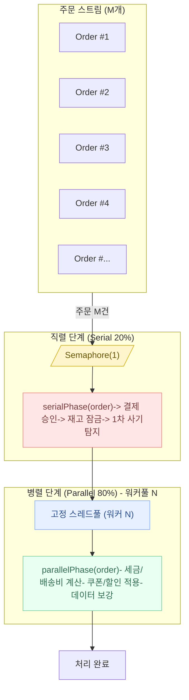

```mermaid
gantt
    title 주문 파이프라인의 시간적 겹침 (Serial 20% -> Parallel 80%)
    dateFormat  X
    axisFormat  %L  %% 단위: 임의 tick

    section Order #1
    직렬(20%)          :a1, 0,   2
    병렬(80%)          :a2, 2,   8

    section Order #2
    직렬(20%)          :b1, 2,   4
    병렬(80%)          :b2, 4,   12

    section Order #3
    직렬(20%)          :c1, 4,   6
    병렬(80%)          :c2, 6,   14

```

좋아요! “암달의 법칙(Amdahl’s Law)”을 이커머스 도메인으로 가정하고, 주문 처리 파이프라인에서 20%는 직렬(결제/재고락 등), 80%는 병렬(세금/배송비/쿠폰 계산 등) 가능하다고 보겠습니다.

## 암달의 법칙 (Amdahl’s Law)

이론적 가속비 $S(N)$는 다음과 같습니다:

$$
S(N) = \frac{1}{(1 - P) + \frac{P}{N}}
$$

여기서,

* $P$ : 병렬화 가능한 비율 (parallelizable fraction)
* $1-P$ : 직렬 처리 비율 (serial fraction)
* $N$ : 프로세서(또는 병렬 워커) 수

### 1. 기본 개념

가속비 $S(N)$는 이렇게 정의돼요:

$$
S(N) = \frac{\text{단일 프로세서로 걸린 시간}}{\text{N개 프로세서로 걸린 시간}}
$$

* **분자(위)**: 워커(프로세서) 1개만 써서 걸린 전체 처리 시간
* **분모(아래)**: 워커 N개를 써서 걸린 전체 처리 시간
* 즉, \*\*“몇 배 빨라졌나?”\*\*를 수치로 보는 거예요.

### 2. 예시로 이해하기

👉 이커머스 주문 100건 처리한다고 가정해 볼게요.

* **N=1 (직렬 처리)**: 100초 걸림
* **N=4 (워커 4개 병렬)**: 25초 걸림

이때 가속비는

$$
S(4) = \frac{100}{25} = 4
$$

→ 워커를 4개로 늘렸더니 **정확히 4배 빨라졌다**는 뜻이에요.

### 3. 하지만 현실은…

암달의 법칙에 따르면, **직렬로밖에 못하는 부분** 때문에 실제 가속비는 이론적 한계보다 낮아져요.

예를 들어:

* 전체 작업의 **20%는 무조건 직렬**이어야 한다고 하면, 아무리 워커 수를 100개로 늘려도 전체 가속비는

  $$
  \frac{1}{0.2 + \frac{0.8}{100}} \approx 4.76
  $$

  즉, **5배도 안 되게 제한**돼요.

### 4. 아주 쉽게 요약

* **가속비** = “몇 배 빨라졌나?”
* 계산법 = “1개로 걸린 시간 ÷ N개로 걸린 시간”
* 100초 걸리던 걸 25초에 끝냈으면, 가속비 = 4배
* 하지만 **직렬 부분** 때문에 무한히 빨라질 수는 없음 → 이게 암달의 법칙의 핵심!

---

### 예제 조건

* 직렬 처리: **20%** → $1-P = 0.2$
* 병렬 처리: **80%** → $P = 0.8$

---

### 이론적 가속비 표

| 병렬 워커 수 $N$ | 가속비 $S(N)$                         |
| ----------- | ---------------------------------- |
| 1           | $1 / (0.2 + 0.8/1) = 1.0$          |
| 2           | $1 / (0.2 + 0.8/2) = 1.667$        |
| 4           | $1 / (0.2 + 0.8/4) = 2.5$          |
| 8           | $1 / (0.2 + 0.8/8) = 3.333$        |
| 16          | $1 / (0.2 + 0.8/16) \approx 3.810$ |
| 32          | $1 / (0.2 + 0.8/32) \approx 4.103$ |

---

